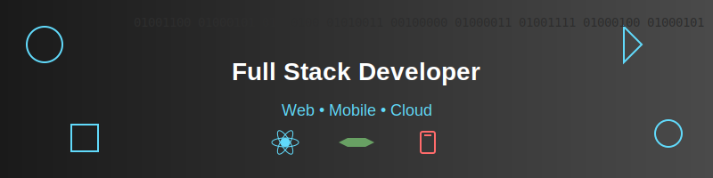

# 👋 Hello, I'm Hari Krishna 

<div align="center">
  
</div>

## 🚀 About Me

Software Engineer passionate about building impactful solutions across web and mobile platforms. I specialize in developing full-stack applications with a focus on modern technologies and best practices. My journey spans from crafting responsive web applications to developing native mobile solutions.

> "Code is like humor. When you have to explain it, it's bad." – Cory House

## 💻 Tech Stack

```javascript
const techStack = {
    frontend: ["React.js", "HTML5", "CSS3", "JavaScript"],
    backend: ["Spring Boot", "Node.js", "Express.js"],
    mobile: ["React Native", "Kotlin"],
    exploring: ["Cloud Technologies", "DevOps", "System Design"]
};
```

## 🛠️ Skills & Expertise

#### Frontend Development
- Building responsive and interactive web applications using React.js
- Modern JavaScript (ES6+)
- State Management & Component Architecture

#### Backend Development
- RESTful API design with Spring Boot & Node.js
- Server-side architecture and database design
- Express.js middleware and routing

#### Mobile Development
- Cross-platform development with React Native
- Native Android development with Kotlin
- Mobile UI/UX implementation

## 🌱 Currently Learning

- Advanced Cloud Architecture
- DevOps Best Practices
- System Design Patterns
- Android Development with Kotlin

## 📈 GitHub Stats

<div align="center">
  
  
  
</div>

## 🤝 Let's Connect!

I'm always interested in collaborating on innovative projects and connecting with fellow developers. If you share similar interests or have exciting opportunities, feel free to reach out!

<div align="center">
  
[](https://www.linkedin.com/in/hari-krishna-b731601b1/)
[](https://x.com/procoder03092)


</div>

---

💡 _"The best way to predict the future is to create it."_
<!---
Hari-krishna-tech/Hari-krishna-tech is a ✨ special ✨ repository because its `README.md` (this file) appears on your GitHub profile.
You can click the Preview link to take a look at your changes.
--->
